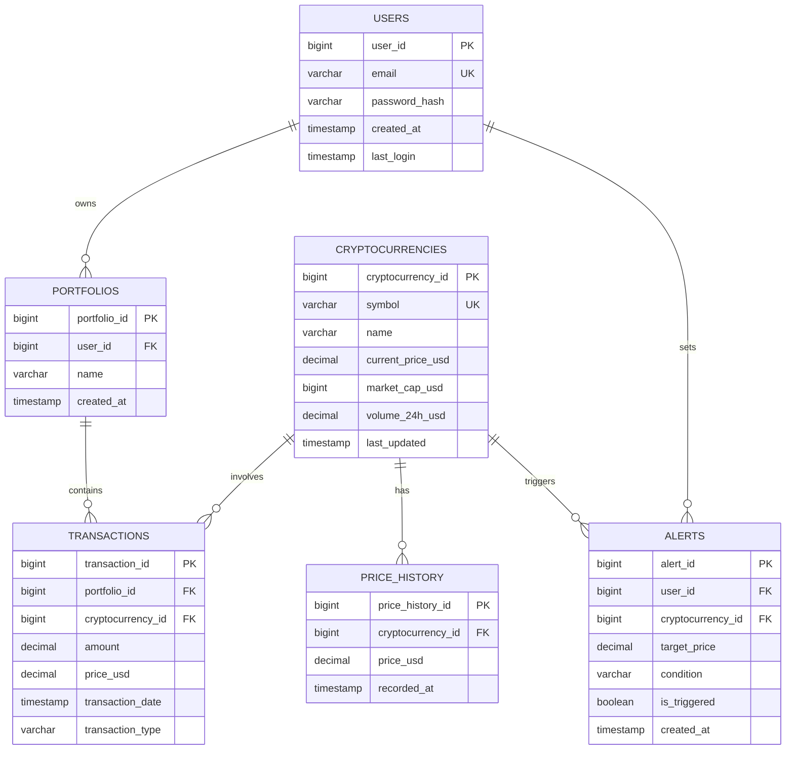

# Cryptik - Cryptocurrency Portfolio Tracker

A robust Spring Boot application for tracking and managing cryptocurrency portfolios with real-time market data integration.

## Features

- 🔐 User authentication and authorization with JWT
- 📊 Real-time cryptocurrency price tracking
- 💼 Multiple portfolio management
- 📈 Transaction tracking and portfolio performance analysis
- ⚡ Real-time price alerts
- 📱 RESTful API with rate limiting
- 📄 Pagination and efficient data fetching
- 🔄 Integration with external cryptocurrency APIs

## Technology Stack

- Java 21
- Spring Boot 3.x
- PostgreSQL
- Spring Security
- JWT Authentication
- Spring Data JPA
- Hibernate
- Lombok
- WebClient
- Bucket4j (Rate Limiting)
- Caffeine Cache

## Database Schema



### Entity Relationships:
- Users can have multiple portfolios and alerts
- Portfolios contain multiple transactions
- Transactions are linked to specific cryptocurrencies
- Cryptocurrencies have price history and can trigger alerts

## API Endpoints

### User Management
```
POST /api/users/register - Register a new user
POST /api/users/login - User login
GET /api/users/profile - Get user profile
PUT /api/users/profile - Update user profile
```

### Portfolio Management
```
POST /api/portfolios - Create a new portfolio
GET /api/portfolios - Get all portfolios (paginated)
GET /api/portfolios/{id} - Get specific portfolio
PUT /api/portfolios/{id} - Update portfolio
DELETE /api/portfolios/{id} - Delete portfolio
GET /api/portfolios/{id}/performance - Get portfolio performance metrics
```

### Transaction Management
```
POST /api/transactions - Add new transaction
GET /api/transactions - Get all transactions (paginated)
GET /api/transactions/{id} - Get specific transaction
PUT /api/transactions/{id} - Update transaction
DELETE /api/transactions/{id} - Delete transaction
```

### Cryptocurrency Data
```
GET /api/cryptocurrencies - Get all cryptocurrencies (paginated)
GET /api/cryptocurrencies/{id} - Get specific cryptocurrency
GET /api/cryptocurrencies/{id}/price-history - Get price history (paginated)
```

### Alert Management
```
POST /api/alerts - Create new price alert
GET /api/alerts - Get all alerts (paginated)
GET /api/alerts/{id} - Get specific alert
PUT /api/alerts/{id} - Update alert
DELETE /api/alerts/{id} - Delete alert
```

## Setup Instructions

### Prerequisites
- Java 17 or higher
- Maven
- PostgreSQL
- Git

### Installation Steps

1. Clone the repository:
```bash
git clone https://github.com/yourusername/cryptik.git
cd cryptik
```

2. Configure PostgreSQL database:
```sql
CREATE DATABASE cryptik;
```

3. Update application.properties:
```properties
spring.datasource.url=jdbc:postgresql://localhost:5432/cryptik
spring.datasource.username=your_username
spring.datasource.password=your_password
spring.jpa.hibernate.ddl-auto=update
spring.jpa.properties.hibernate.dialect=org.hibernate.dialect.PostgreSQLDialect
```

4. Build the project:
```bash
mvn clean install
```

5. Run the application:
```bash
mvn spring-boot:run
```

The application will be available at `http://localhost:8080`

## Configuration

### Rate Limiting
Rate limiting is configured per endpoint:
- Authentication endpoints: 3 requests per minute
- API endpoints: 100 requests per minute per user

### External API Integration
The application integrates with CoinGecko API for real-time cryptocurrency data. Configure the API key in application.properties:
```properties
coingecko.api.key=your_api_key
coingecko.api.base-url=https://api.coingecko.com/api/v3
```

## Security

- JWT-based authentication
- Password encryption using BCrypt
- Rate limiting to prevent abuse
- Input validation on all endpoints
- CORS configuration for frontend integration

## Contributing

1. Fork the repository
2. Create your feature branch (`git checkout -b feature/AmazingFeature`)
3. Commit your changes (`git commit -m 'Add some AmazingFeature'`)
4. Push to the branch (`git push origin feature/AmazingFeature`)
5. Open a Pull Request
